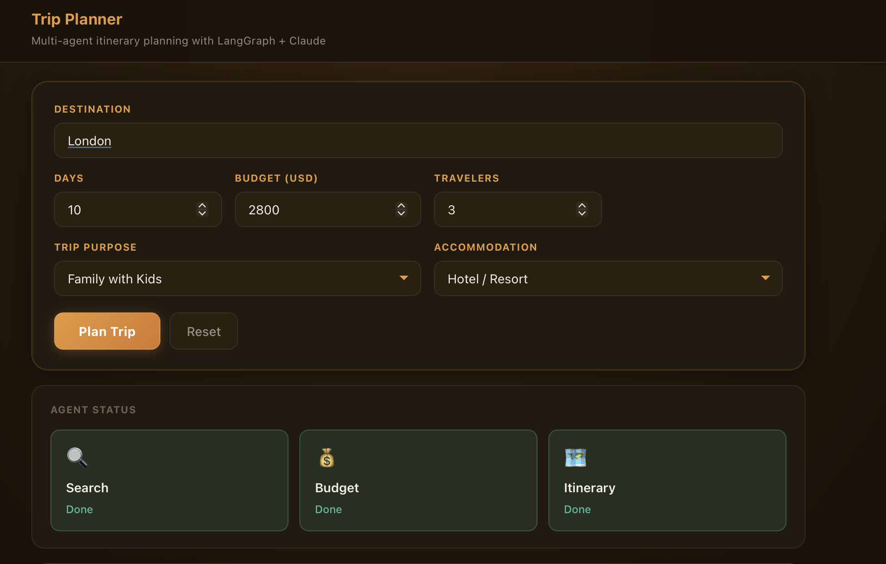
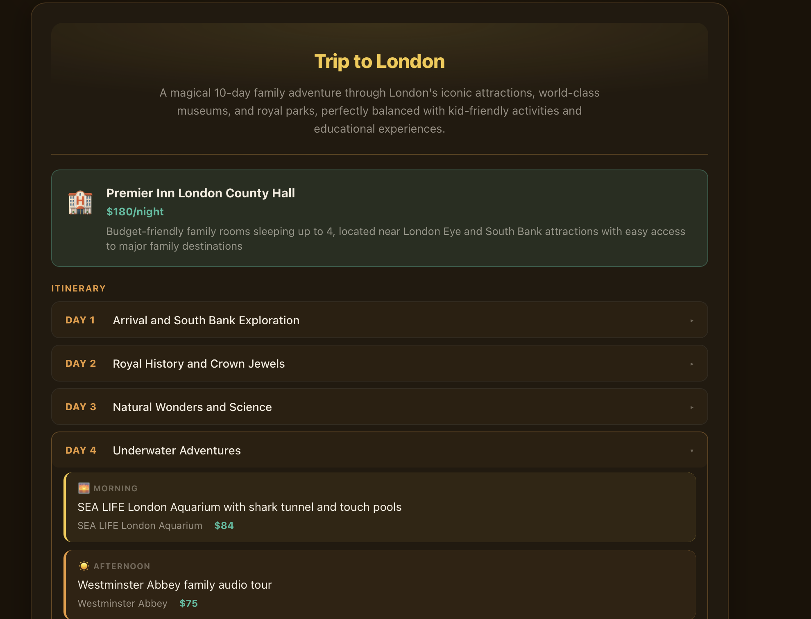
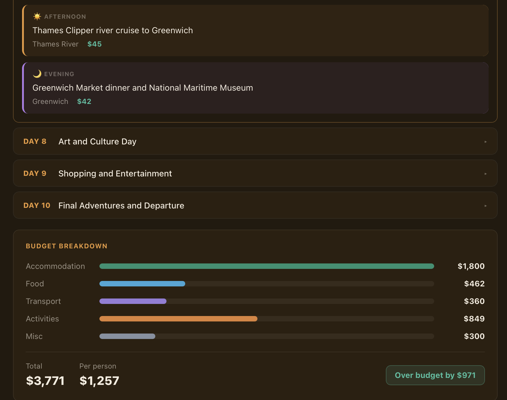
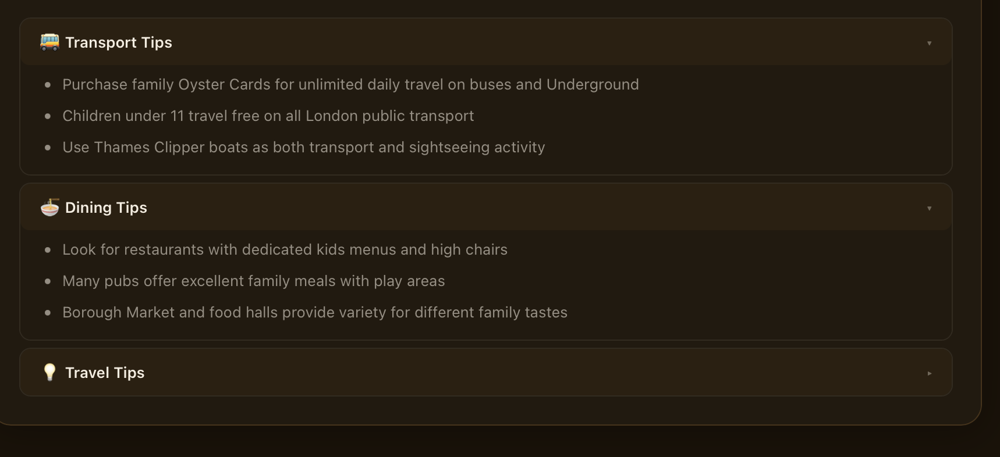

# Trip Planner with Claude Agents

A multi-agent AI travel planner powered by **Claude**, **LangGraph**, and **React**. Enter a destination, number of days, budget, and travelers — three specialized AI agents work in parallel to generate a complete day-by-day itinerary with budget breakdown and travel tips.

---

## Screenshots

### Planning Form — destination, days, budget, purpose & accommodation


### Result — trip overview, hotel recommendation & day-by-day itinerary


### Budget Breakdown — visual bar chart with total & per-person cost


### Travel Tips — transport, dining & travel tips


---

## How It Works

```
React Client (Vite)
      │  SSE stream
      ▼
Express Server (Node.js)
      │
      ▼
LangGraph StateGraph
   ┌──────────┬────────────┐
   ▼          ▼            │  (parallel)
Search      Budget         │
Agent       Agent          │
   │          │            │
   └────┬─────┘            │
        ▼                  │
   Itinerary Agent ◄───────┘
   (streams token by token)
        │
        ▼
   Final JSON itinerary
```

### The Three Agents

| Agent | Role |
|---|---|
| **Search** | Researches attractions, hotels, flights, and transport for the destination — returns structured JSON |
| **Budget** | Calculates a cost breakdown across accommodation, food, transport, activities, and misc |
| **Itinerary** | Combines both outputs into a structured day-by-day plan, streamed token-by-token to the UI |

Search and Budget run **in parallel** (LangGraph fan-out from `START`), then both feed into the Itinerary agent — minimizing total wait time.

### Optimizations

- **In-memory cache** — repeated queries for the same destination/days/budget/people return instantly
- **Structured search output** — Search agent returns JSON, reducing tokens the Itinerary agent needs to process
- **Token streaming** — Itinerary generation streams to the browser in real time with a live typing cursor
- **`maxTokens: 800`** on every model call — trims cost and latency without losing quality

---

## Tech Stack

| Layer | Technology |
|---|---|
| Frontend | React 18, Vite |
| Backend | Node.js, Express |
| AI Orchestration | LangGraph (`@langchain/langgraph`) |
| LLM | Claude (`claude-sonnet-4-20250514`) via `@langchain/anthropic` |
| Streaming | Server-Sent Events (SSE) |

---

## Getting Started

### Prerequisites

- Node.js 20.19+ or 22.12+
- An [Anthropic API key](https://console.anthropic.com/)

### 1. Clone the repo

```bash
git clone https://github.com/your-username/trip-planner-claude-agents.git
cd trip-planner-claude-agents
```

### 2. Set up the server

```bash
cd server
cp .env.example .env
# Edit .env and add your key:
# ANTHROPIC_API_KEY=sk-ant-...
npm install
node index.js
# Server runs on http://localhost:3001
```

### 3. Set up the client

```bash
cd ../client
npm install
npm run dev
# Client runs on http://localhost:5174
```

### 4. Open the app

Go to **http://localhost:5174**, enter a destination, and click **Plan Trip**.

---

## Project Structure

```
.
├── server/
│   ├── index.js          # Express server, SSE endpoint
│   ├── trip-agent.js     # LangGraph agents + cache + streaming
│   ├── .env.example      # Environment variable template
│   └── package.json
├── client/
│   ├── src/
│   │   ├── App.jsx       # React UI — form, agent cards, result view
│   │   └── App.css       # Styles
│   ├── index.html
│   └── package.json
├── .gitignore
└── README.md
```

---

## Port Reference

| Service | Port |
|---|---|
| Backend (Express) | 3001 |
| Frontend (Vite) | 5174 |

---

## Environment Variables

| Variable | Required | Description |
|---|---|---|
| `ANTHROPIC_API_KEY` | Yes | Your key from [console.anthropic.com](https://console.anthropic.com/) |

---

## License

MIT
